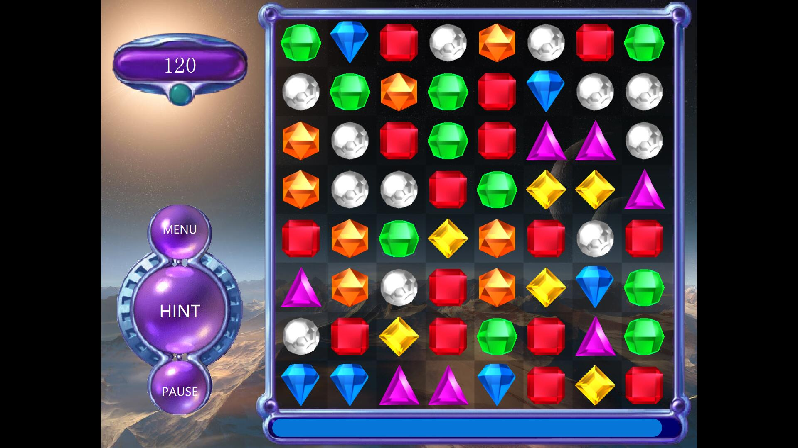

# Bejeweled 2021

##Introduction

QT based imitation gem puzzle game

In this project, we used c++ language to realize the gem puzzle game based on QT, and accessed the database to realize the functions of login registration and ranking according to the highest score. In order to optimize the user experience, we provided the sound and brightness adjustment slider in the setting interface, and opened the help document and website interface. In terms of gameplay, click the "start" button on the main interface to select three types of difficulty according to your own requirements. The types of elimination blocks in the game interface will increase with the increase of difficulty. In addition, the game interface provides an interface for pause, prompt and return to the main menu. The "magic box" is introduced to increase gameplay and playability.

##Software architecture

`CGammaRamp. h`

Call 'windowsAPI' to change the screen brightness

`gamewidget. h`

Game interface

`gem. h`

Gem class, defining gem coordinates and animation

`hoverbutton. h`

Override the 'QPushButton' class to use this button in the main menu

`myprobar. h`

Override the 'qprogressbar' class

`PixmapSlider. h`

Customize QSlider

`selectlevel. h`

Select difficulty interface

`settingpage. h`

Main menu setting interface

`startpage. H` main menu interface

##Screenshot

The menu interface provides viewing the leaderboard, starting the game, setting the interface, registering, logging in and logging out

set up

The difficulty selection interface provides three kinds of difficulty choices

Game interface

-The right side of the game interface is a gem chessboard, and the lower side of the chessboard is a time bar. The game ends when the time bar returns to zero

-Click any two adjacent gems on the chessboard to exchange them. If there are at least three adjacent identical gems after exchange, eliminate them and increase the corresponding score. At the same time, the more gems eliminated, the higher the score

-If more than three gems are removed at the same time, different magic gems will be formed according to the number of gems at the same time. Magic gems have special skills for players to explore

-The upper right corner of the interface is the integration board, where you can view the scores obtained

-The lower right corner of the interface is the operation button. Click 'menu' to return to the main menu, click 'hint' to get the exchange prompt, and click 'pause' to pause the time bar

-The score displayed in the upper right corner at the end of the specified time indicates the score obtained by the game player in this game

## Contribution

1.  Fork the repository
2.  Create Feat_xxx branch
3.  Commit your code
4.  Create Pull Request

