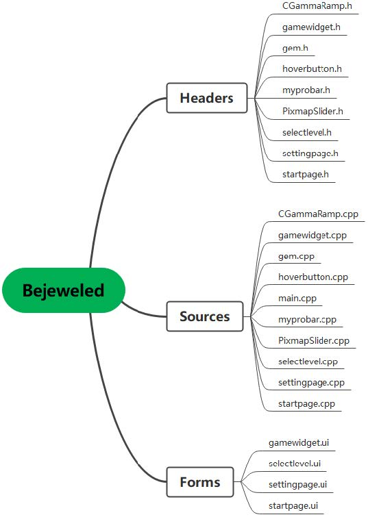
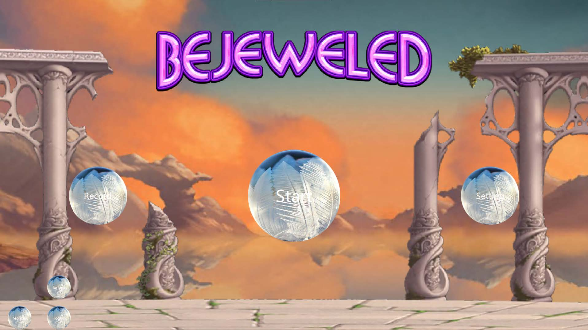
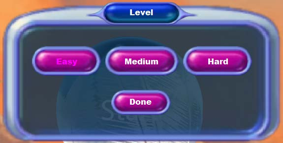
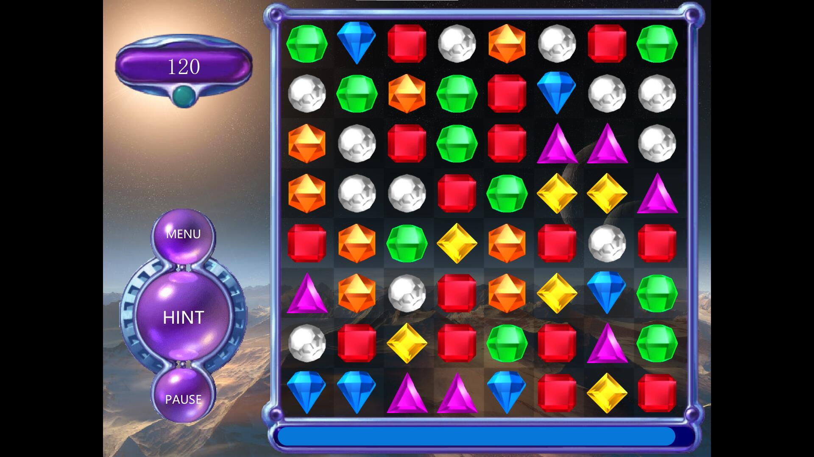

# Bejeweled 2021

## 介绍
基于QT的模仿宝石迷阵游戏

本次项目我们使用C++语言，实现了基于QT的宝石迷阵游戏，并且接入数据库实现了登录注册和根据最高分排行的功能，为了优化用户体验，在设置界面提供声音、亮度的调整滑块和打开帮助文档以及网站的接口。在游戏性方面，点击主界面的“start”按钮，可以根据自身要求选择三种难度，游戏界面消除方块的种类会随着难度上调而增加，并且在游戏界面提供暂停、提示、返回主菜单的接口，引入“魔法方块”来增加游戏性和可玩性。

## 软件架构

`CGammaRamp.h`
调用`WindowsAPI`，改变屏幕亮度

`gamewidget.h`
游戏界面

`gem.h`
宝石类，定义宝石坐标和动画

`hoverbutton.h`
重写`QPushButton`类，于主菜单使用此按钮

`myprobar.h`
重写`QProgressBar`类

`PixmapSlider.h`
自定义Qslider

`selectlevel.h`
选择难度界面

`settingpage.h`
主菜单设置界面

`startpage.h`主菜单界面

## 屏幕截图

菜单界面提供查看排行榜，开始游戏，设置接口，注册，登录，登出
设

难度选择界面，提供三种难度的选择

游戏界面
- 游戏界面右侧为宝石棋盘，棋盘下侧为时间条，时间条归零则游戏结束
- 点击棋盘任意两个相邻的宝石则可以交换它们，若交换后存在至少三个相邻的相同宝石，则消去它们，同时增加相应分数，同时消除越多的宝石得分越高
- 如果同时消去的宝石大于三个，会根据同时校区宝石个数不同形成不同的魔法宝石，魔法宝石拥有特殊的技能，供玩家探索
- 界面右上角为积分板，可以在这里查看所得的分数
- 界面右下角为操作按钮，点击`MENU`返回主菜单，点击`HINT`得到交换提示，点击`PAUSE`时间条静止表示时间暂停
- 规定时间结束显示在右上角的分数表示这一局游戏玩家所得分数

## 参与贡献

1.  Fork 本仓库
2.  新建 Feat_xxx 分支
3.  提交代码
4.  新建 Pull Request

